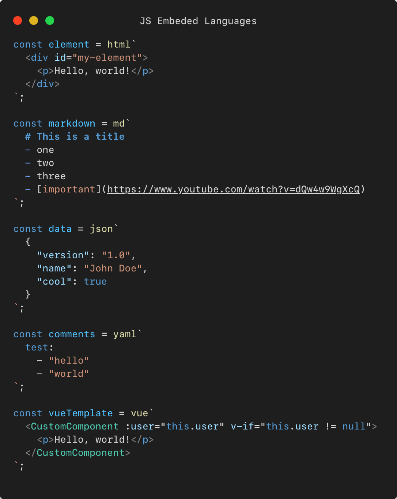

<center>
  
  <h1>Javascript Embeded Languages</h1>
  <p>Bring syntax highlighting from other languages to JS.</p>
</center>



Supported languages:
  - html
  - xml
  - xsl
  - pug
  - vue (html)
  - handlebars
  - css
  - less
  - scss
  - json
  - yaml
  - ini
  - sql
  - md

Usage:

```js
const first = html``;
const second = /*html*/``;
```

Shoutouts:
  - https://github.com/Digitalbrainstem
  - https://github.com/ehoogeveen-medweb
  - https://github.com/0x00000001A


Building:
1. Generate grammar: `python3 ./build.py`
2. Run vscode (F5 or Run>Start Debugging) 


Feel free to create issue if your language is not supported.
